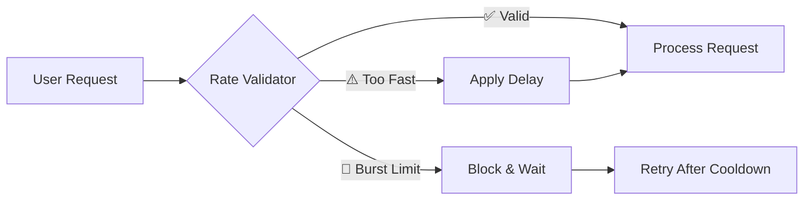

# 🛡️ SlopScraper Security Overview
## *From Vulnerable to Bulletproof: A Security Transformation*

---

## 🌟 If Rome Was Built In A Day

SlopScraper is officially overengineered to safely collect Steam game launch options while protecting against abuse, attacks, and resource exhaustion. I used this as an exercise in learning security (hopefully) enterprise-level security practices. Full transparency, I used AI to analyze my code and attack the weaknesses to expose vulnerabilities.

Our security implementation follows three key principles...
- **🔐 Defense in Depth** - Multiple security layers protect against different attack vectors
- **⚡ Fail-Safe Design** - When something goes wrong, the system defaults to secure behavior
- **📊 Proactive Monitoring** - Real-time tracking prevents problems before they escalate

---

### 🚀 **Rate Limiting & Traffic Control**
*Prevents API abuse and service disruption*



**What it does:**
- 🕒 **Minimum 1-second delays** between requests (no more hammering APIs!)
- 🚦 **Burst protection** - max 5 requests per minute to prevent overwhelming servers
- 🎯 **Smart throttling** - automatically adjusts based on server response times

**Real-world impact:**
- Prevents IP bans from Steam and PCGamingWiki
- Maintains good relationships with data sources
- Ensures consistent service availability

---

### 🔒 **Input Validation & Sanitization**
*Stops malicious input before it can cause damage*

| Input Type | Validation Applied | Protection Against |
|------------|-------------------|-------------------|
| **Game Limits** | 1-1000 range enforced | 🚫 Resource exhaustion |
| **File Paths** | Restricted to safe directories | 🚫 Path traversal attacks |
| **URLs** | Format & domain validation | 🚫 SSRF attacks |
| **Game Titles** | Length & character filtering | 🚫 Injection attacks |
| **Cache Size** | 100MB maximum | 🚫 Disk space abuse |

**Visual Protection Flow:**
```
User Input → 🔍 Validate → 🧹 Sanitize → ✅ Safe Processing
     ↓
⚠️ Invalid Input → 🛑 Reject → 📝 Log → 🔄 Use Safe Default
```

---

### 🌐 **Secure Web Requests**
*Every external request is protected and monitored*

#### **Before vs After Security Upgrade**

| Aspect | ❌ Before | ✅ After |
|--------|----------|---------|
| **Timeouts** | None (hang forever) | 30 seconds max |
| **Response Size** | Unlimited (memory bombs) | 10MB limit |
| **Redirects** | Unlimited (infinite loops) | 3 maximum |
| **User Agent** | Default Python (often blocked) | Proper identification |
| **Error Handling** | Crashes on failure | Graceful degradation |

#### **Security Request Pipeline**
```
🌐 URL Request
    ↓
🔍 Validate URL format
    ↓
⏱️ Apply timeout (30s)
    ↓
📏 Check response size (10MB max)
    ↓
🔄 Limit redirects (3 max)
    ↓
✅ Safe content delivered
```

#### **Security Hierarchy** (Most Secure → Least Secure)
```
🥇 Environment Variables (Recommended)
   └── Encrypted in memory
   └── No file system exposure
   └── Easy CI/CD integration

🥈 Secure Credential Files
   └── File permission validation
   └── Format verification
   └── HTTPS enforcement

🥉 Manual Input (Fallback)
   └── Secure prompting
   └── No storage on disk
```

**What we validate:**
- ✅ HTTPS-only URLs (no plain HTTP allowed)
- ✅ Proper Supabase domain validation
- ✅ Key length and format verification
- ✅ File permission checking (600 or stricter)

---

### 📊 **Real-Time Monitoring Dashboard**
*Constant vigilance against abuse and anomalies*

#### **Traffic Light System**
```
🟢 NORMAL OPERATION
├── Request rate < 5/sec
├── Error rate < 5%
├── Runtime < 2 hours
└── Cache size < 50MB

🟡 ELEVATED MONITORING  
├── Request rate 5-10/sec → Warning logged
├── Error rate 5-15% → Retry mechanisms active
├── Runtime 2-4 hours → Progress checkpoints
└── Cache size 50-80MB → Cleanup suggestions

🔴 PROTECTIVE MEASURES
├── Request rate >10/sec → Forced delays
├── Error rate >20% → Automatic shutdown
├── Runtime >6 hours → Forced termination
└── Cache size >100MB → Auto-backup & reset
```

#### **Abuse Detection Patterns**
- 🔍 **Rapid Successive Runs** - Prevents bot-like behavior
- 📈 **Unusual Request Patterns** - Detects automated abuse
- 💥 **High Error Rates** - Identifies problematic configurations
- ⏰ **Extended Runtime** - Catches infinite loops

---


## 📈 **Performance & Efficiency**

### **Resource Usage Optimization**

| Resource | Optimization | Benefit |
|----------|-------------|---------|
| **Memory** | 100MB cache limit | Prevents system slowdown |
| **Network** | 10MB response limits | Faster processing |
| **CPU** | Smart throttling | Consistent performance |
| **Disk** | Automatic cleanup | No storage bloat |

### **Security Overhead**
```
Total Security Overhead: ~2-5% performance impact
├── Input Validation: <1ms per operation ⚡
├── Request Security: ~10ms per request 🌐
├── Monitoring: <1ms per action 📊
└── Rate Limiting: 1000ms+ per request ⏱️
                   (intentional for protection)
```

**💡 The Trade-off:** Slightly slower execution in exchange for increased security and reliability.

---

## 🔧 **Developer-Friendly Features**

### **Intelligent Error Messages**
Instead of cryptic failures, users get helpful guidance:

```bash
❌ Old: "Permission denied"
✅ New: "⚠️ Output path targets system directory. Using safe default: ./test-output"

❌ Old: "Connection timeout" 
✅ New: "🔒 Request timed out after 30s. Try increasing --rate for slower connections"

❌ Old: "Invalid input"
✅ New: "⚠️ Games limit too high. Security cap applied: 1000 games maximum"
```

### **Configuration Flexibility**
Users can customize security settings while staying protected:

```bash
# Conservative (safest)
slop-scraper --rate 5.0 --limit 10

# Balanced (recommended)  
slop-scraper --rate 2.0 --limit 100

# Aggressive (still safe)
slop-scraper --rate 1.0 --limit 1000
```

---

## 🚀 **What This Means for Your Project**

### **🛡️ Enterprise-Ready Security**
- Safe to run in production environments
- Suitable for automated/scheduled execution
- Ready for team collaboration

### **⚡ Scalable Architecture**
- Handles small personal projects (5-10 games)
- Scales to large research projects (1000+ games)
- Efficient resource usage at any scale

### **🔧 Maintenance-Free Operation**
- Self-monitoring and self-healing
- Automatic cleanup and optimization
- Clear logging for any issues

---

🏆 ACHIEVEMENT UNLOCKED: SAFETY FIRST
┌─────────────────────────────────────────┐
│ 🚫 Attack Resistant                    │
│ ⚡ Performance Optimized                │  
│ 🔒 Privacy Protected                    │
│ 📊 Fully Monitored                     │
│ 🛠️ Developer Friendly                  │
│ 🚀 Production Ready                     │
└─────────────────────────────────────────┘

```